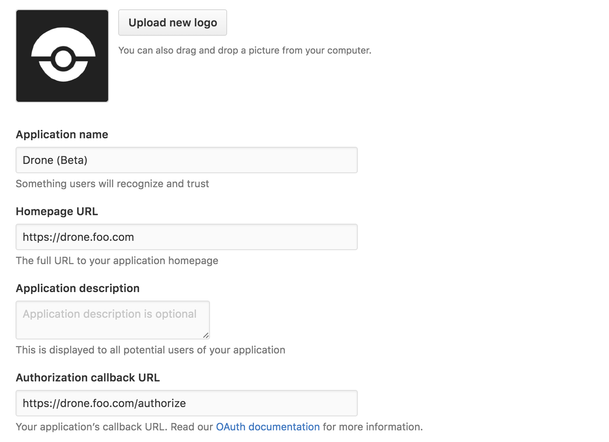
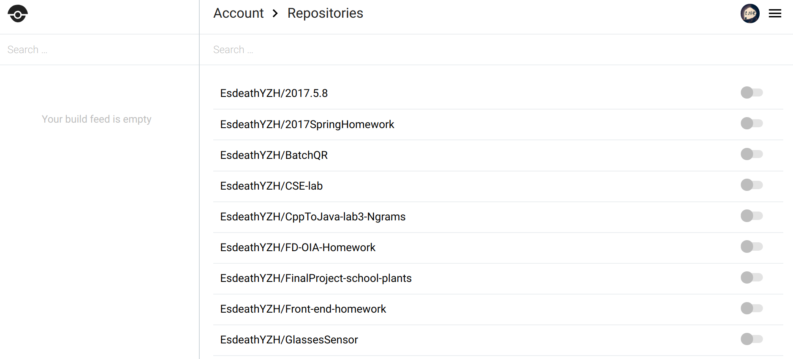

# Prepare a CI/CD environment
### CICD环境
阿里云ECS云服务器 + Ubuntu16.04 + Drone 0.8.0
### 搭建步骤
+ 安装docker-compose
+ 编写部署Drone的yaml文件，yaml配置文件已在下方列出

```
version: '2'

services:
  drone-server:
    image: drone/drone:0.8

    ports:
      - 80:8000
      - 9000
    volumes:
      - /var/lib/drone:/var/lib/drone/
    restart: always
    environment:
      - DRONE_OPEN=true
      - DRONE_HOST=${DRONE_HOST}
     - DRONE_GITHUB=true
     - DRONE_GITHUB_CLIENT=${DRONE_GITHUB_CLIENT}
    - DRONE_GITHUB_SECRET=${DRONE_GITHUB_SECRET}
      - DRONE_SECRET=${DRONE_SECRET}
      
  drone-agent:
    image: drone/agent:0.8
    restart: always
    depends_on:
      - drone-server
    volumes:
      - /var/run/docker.sock:/var/run/docker.sock
    environment:
      - DRONE_SERVER=drone-server:9000
      - DRONE_SECRET=${DRONE_SECRET}
```
+ 在github上为Drone注册一个新的oAuth应用

+ 使用之前注册应用产生的client id与secret来补全配置文件
+ docker-compose up -d启动drone，使用github账号登录Drone
+ Drone搭建完成

### 运行截图

通过点击repo右方按钮即可开启对该仓库的CI/CD

上图为每次PR后的build界面

### 参考
[官方文档:https://0-8-0.docs.drone.io/install-for-github/](https://0-8-0.docs.drone.io/install-for-github/)