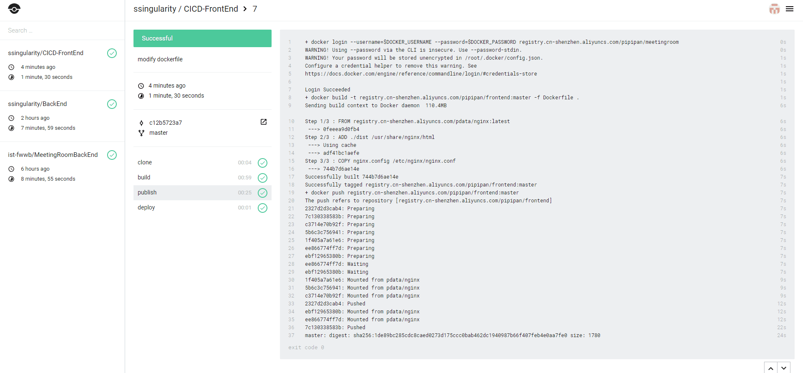

#部署Web应用
### 项目来源
本次作业由于任老师有具体要求而且本次作业的重点也不在于Web App开发，所以我们选用了github上的一个web项目作为CICD的目标Web App

[github前端仓库地址](https://github.com/ssingularity/CICD-FrontEnd)
[github后端仓库地址](https://github.com/ssingularity/CICD-BackEnd)

### 技术栈
+ 前端  vue.js + node.js + webpack

+ 后端 spring boot 1.5.9

+ 数据库 Mysql

###部署过程
####1.在前后端两个项目的目录下分别创建.drone.yaml，Drone会根据这个文件CICD

下面附上后端项目的.drone.yaml：
```
pipeline:
  build: 
    image: registry.cn-hangzhou.aliyuncs.com/acs/maven
    commands:
      - mvn clean package -DskipTests
    volumes:
      - /root/maven/repository:/root/.m2/repository
      - /root/maven/settings.xml:/usr/share/maven/conf/settings.xml
  
  publish:
    image: docker
    secrets: [docker_username,docker_password]
    commands:
        - docker login --username=$DOCKER_USERNAME --password=$DOCKER_PASSWORD registry.cn-shenzhen.aliyuncs.com/pipipan/meetingroom
        - docker build -t registry.cn-shenzhen.aliyuncs.com/pipipan/backend:master -f Dockerfile .
        - docker push registry.cn-shenzhen.aliyuncs.com/pipipan/backend:master
    volumes:
        - /var/run/docker.sock:/var/run/docker.sock
    when:
        branch: master
        status: success

  deploy:
    image: appleboy/drone-ssh
    host: 129.211.119.51
    secrets: [ssh_username, ssh_password]
    port: 22
    script:
      - /root/shell/backend-deployment.sh
```

前端项目的.drone.yaml:
```
pipeline:
  build: 
    image: registry.cn-shenzhen.aliyuncs.com/pipipan/node:1.0
    commands:
      - npm install
      - npm run-script build
  publish:
    image: docker
    secrets: [docker_username,docker_password]
    commands:
        - docker login --username=$DOCKER_USERNAME --password=$DOCKER_PASSWORD registry.cn-shenzhen.aliyuncs.com/pipipan/meetingroom
        - docker build -t registry.cn-shenzhen.aliyuncs.com/pipipan/frontend:master -f Dockerfile .
        - docker push registry.cn-shenzhen.aliyuncs.com/pipipan/frontend:master
    volumes:
        - /var/run/docker.sock:/var/run/docker.sock
    when:
        branch: master
        status: success

  deploy:
    image: appleboy/drone-ssh
    host: 129.211.119.51
    secrets: [ssh_username, ssh_password]
    port: 22
    script:
      - /root/shell/frontend-deployment.sh
```

可以看到，Drone的CICD由build, publish, deploy几个阶段构成，而Drone一个很大的特点就是CICD的每一个阶段都是在镜像中完成的。Drone相比jenkins的好处是，所有的image都是开发者提供，不需要运维参与在CI服务器上部署各种语言编译需要的环境。

####2.在前后端两个项目的目录下分别创建Dockerfile

后端Dockerfile：
```
FROM registry.cn-shenzhen.aliyuncs.com/javajs/java
VOLUME /tmp
RUN mkdir /app
ADD target/springboot_vue-0.0.1-SNAPSHOT.jar /app/app.jar
ADD runboot.sh /app
RUN bash -c 'touch /app/app.jar'
WORKDIR /app
RUN chmod a+x runboot.sh
EXPOSE 8080
CMD /app/runboot.sh
```

前端Dockerfile：
```
 FROM node:8.0.0
 # 将根目录下的文件都copy到container（运行此镜像的容器）文件系统的app文件夹下
 ADD . /app/build
 # cd到app文件夹下
 WORKDIR /app
 Run cd /app
 RUN npm install -g serve
 # 容器对外暴露的端口号
 EXPOSE 8080
 # 容器启动时执行的命令，类似npm run start
 CMD ["serve", "-s", "build"]
```

####3.之后每次PR，Drone都会自动根据yaml文件构建镜像
下面是Drone build截图：

