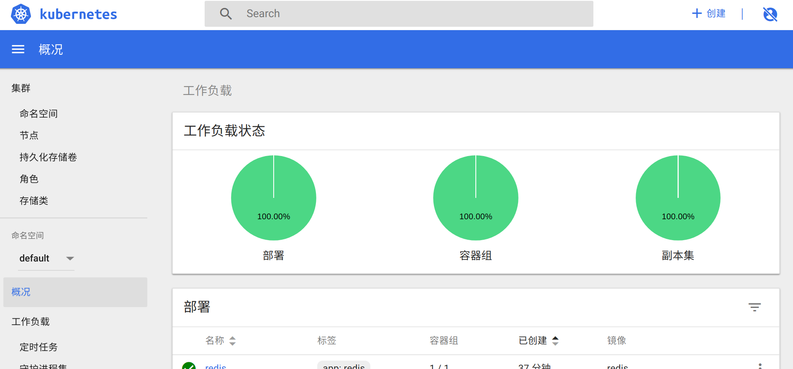

#搭建Kubernete环境
###搭建过程

本次搭建K8S环境，我们使用了一个开源的轻量级K8S安装程序：RKE

+ Kubernete运行的模式为cluster模式，我们在两台云服务器上搭建K8S平台，一台为master，一台为worker

+ 在Kubeadm上配置hosts文件，添加node1，etcd，配置ssh使master可以登录worker

+ 安装rke-v0.1.13，直接将github上的release可执行文件mv到搭建目录之后更名为rke

+ ./rke config生成cluster.yml，根据命令行提示输入节点信息
```
# If you intented to deploy Kubernetes in an air-gapped environment,
# please consult the documentation on how to configure custom RKE images.
nodes:
- address: 172.17.0.8
  port: "22"
  internal_address: 172.17.0.8
  role:
  - controlplane
  - etcd
  user: root
  docker_socket: /var/run/docker.sock
  ssh_key: ""
  ssh_key_path: ~/.ssh/id_rsa
  labels: {}
- address: 172.17.0.4
  port: "22"
  internal_address: 172.17.0.4
  role:
  - worker
  hostname_override: ""
  user: root
  docker_socket: /var/run/docker.sock
  ssh_key: ""
  ssh_key_path: ~/.ssh/id_rsa
  labels: {}
services:
  etcd:
    image: ""
    extra_args: {}
    extra_binds: []
    extra_env: []
    external_urls: []
    ca_cert: ""
    cert: ""
    key: ""
    path: ""
    snapshot: null
    retention: ""
    creation: ""
  kube-api:
    image: ""
    extra_args: {}
    extra_binds: []
    extra_env: []
    service_cluster_ip_range: 10.43.0.0/16
    service_node_port_range: ""
    pod_security_policy: false
  kube-controller:
    image: ""
    extra_args: {}
    extra_binds: []
    extra_env: []
    cluster_cidr: 10.42.0.0/16
    service_cluster_ip_range: 10.43.0.0/16
  scheduler:
    image: ""
    extra_args: {}
    extra_binds: []
    extra_env: []
  kubelet:
    image: ""
    extra_args: {}
    extra_binds: []
    extra_env: []
    cluster_domain: cluster.local
    infra_container_image: ""
    cluster_dns_server: 10.43.0.10
    fail_swap_on: false
  kubeproxy:
    image: ""
    extra_args: {}
    extra_binds: []
    extra_env: []
network:
  plugin: flannel
  options: {}
authentication:
  strategy: x509
  options: {}
  sans: []
addons: ""
addons_include: []
system_images:
  etcd: rancher/coreos-etcd:v3.2.18
  alpine: rancher/rke-tools:v0.1.15
  nginx_proxy: rancher/rke-tools:v0.1.15
  cert_downloader: rancher/rke-tools:v0.1.15
  kubernetes_services_sidecar: rancher/rke-tools:v0.1.15
  kubedns: rancher/k8s-dns-kube-dns-amd64:1.14.10
  dnsmasq: rancher/k8s-dns-dnsmasq-nanny-amd64:1.14.10
  kubedns_sidecar: rancher/k8s-dns-sidecar-amd64:1.14.10
  kubedns_autoscaler: rancher/cluster-proportional-autoscaler-amd64:1.0.0
  kubernetes: rancher/hyperkube:v1.11.5-rancher1
  flannel: rancher/coreos-flannel:v0.10.0
  flannel_cni: rancher/coreos-flannel-cni:v0.3.0
  calico_node: rancher/calico-node:v3.1.3
  calico_cni: rancher/calico-cni:v3.1.3
  calico_controllers: ""
  calico_ctl: rancher/calico-ctl:v2.0.0
  canal_node: rancher/calico-node:v3.1.3
  canal_cni: rancher/calico-cni:v3.1.3
  canal_flannel: rancher/coreos-flannel:v0.10.0
  wave_node: weaveworks/weave-kube:2.1.2
  weave_cni: weaveworks/weave-npc:2.1.2
  pod_infra_container: rancher/pause-amd64:3.1
  ingress: rancher/nginx-ingress-controller:0.16.2-rancher1
  ingress_backend: rancher/nginx-ingress-controller-defaultbackend:1.4
  metrics_server: rancher/metrics-server-amd64:v0.2.1
ssh_key_path: ~/.ssh/id_rsa
ssh_agent_auth: false
authorization:
  mode: rbac
  options: {}
ignore_docker_version: false
kubernetes_version: ""
private_registries: []
ingress:
  provider: ""
  options: {}
  node_selector: {}
  extra_args: {}
cluster_name: ""
cloud_provider:
  name: ""
prefix_path: ""
addon_job_timeout: 0
bastion_host:
  address: ""
  port: ""
  user: ""
  ssh_key: ""
  ssh_key_path: ""
monitoring:
  provider: ""
  options: {}
```
+ ./rke  up 完成K8S搭建

### Dashboard
+ 通过地址：https://raw.githubusercontent.com/kubernetes/dashboard/master/src/deploy/recommended/kubernetes-dashboard.yaml ，能够下载kubernetes-dashboard.yaml文件

+ 编辑下载好的yaml文件，在service部分添加type: NodePort和nodePort: 32000

+ 执行命令部署web UI
```
kubectl create -f  ./kubernetes-dashboard.yaml
```

+ 之后我们就可以通过32000端口访问dashboard,下面是访问截图


+ 创建管理员用户kubernetes-dashboard，创建dashboard-admin.yaml文件
```
apiVersion: rbac.authorization.k8s.io/v1beta1
kind: ClusterRoleBinding
metadata:
  name: kubernetes-dashboard
  labels:
    k8s-app: kubernetes-dashboard
roleRef:
  apiGroup: rbac.authorization.k8s.io
  kind: ClusterRole
  name: cluster-admin
subjects:
- kind: ServiceAccount
  name: kubernetes-dashboard
  namespace: kube-system
```
执行命令创建管理员用户：
```
kubectl create -f ./admin-user.yaml
```

+ 获取管理员用户的Token，执行如下命令：
```
kubectl describe  secret kubernetes-dashboard --namespace=kube-system
```

+ 打开kubeconfig文件(~/.kube/config)，并添加Token

+ 从web界面 导入kubeconfig文件，完成dashboard搭建

### DNS