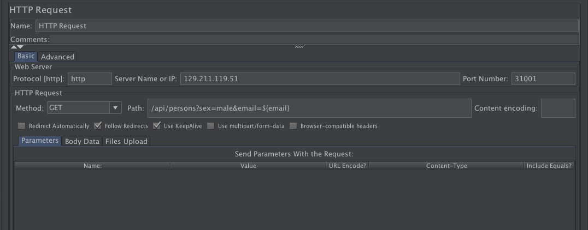
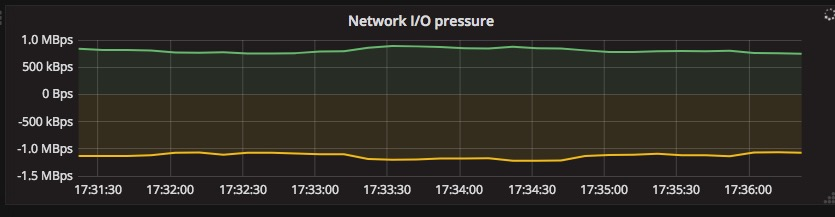

# 在Kubernete上实现自动伸缩
+ 我们期望当服务器的CPU压力增大时，它能自动增加服务的数量，来应对突发的workload
+ 首先我们使用jmeter，进行压力测试
```
    Jmeter  是一款使用Java开发的，开源免费的，测试工具， 主要用来做功能测试和性能测试（压力测试/负载测试）. 
    步骤一：新建一个Thread Group,  jmeter的所有任务都必须由线程处理，所有任务都必须在线程组下面创建。
    步骤一：发送一个Get 方法的http 请求: http://129.211.119.51:31001/api/persons?sex=male&email=
    步骤二：为请求添加动态参数。可以使用读取文件的方式，添加多个动态参数到测试中，jmeter会随机使用我们数据进行测试。
    添加CSV默认值来源文件和变量值。
    在http请求中使用${变量名} 获得文件中的值。
    步骤三：添加查看结果树
    步骤四：执行后，即可通过”查看结果树“查询
```



+ 接着我们部署prometheus和node_exporter进行对服务器进行监控
```
    Prometheus（普罗米修斯）是一套开源的监控&报警&时间序列数据库的组合.由SoundCloud公司开发。
    Prometheus基本原理是通过HTTP协议周期性抓取被监控组件的状态，这样做的好处是任意组件只要提供HTTP接口就可以接入监控系统，不需要任何SDK或者其他的集成过程。这样做非常适合虚拟化环境比如VM或者Docker 。

    输出被监控组件信息的HTTP接口被叫做exporter 。目前互联网公司常用的组件大部分都有exporter可以直接使用，比如Varnish、Haproxy、Nginx、MySQL、Linux 系统信息 (包括磁盘、内存、CPU、网络等等)。
    
    与其他监控系统相比，Prometheus的主要特点是：

    + 一个多维数据模型（时间序列由指标名称定义和设置键/值尺寸）。
    + 非常高效的存储，平均一个采样数据占~3.5bytes左右，320万的时间序列，每30秒采样，保持60天，消耗磁盘大概228G。
    + 一种灵活的查询语言。
    + 不依赖分布式存储，单个服务器节点。
    + 时间集合通过HTTP上的PULL模型进行。
    + 通过中间网关支持推送时间。
    + 通过服务发现或静态配置发现目标。
    + 多种模式的图形和仪表板支持。

```

prometheus配置：
```
    scrape_configs:
        - job_name: 'prometheus'
    static_configs:
        - targets: ['localhost:9090']
            - job_name: 'cpu-supervisor-1'
    static_configs:
        - targets: ['129.211.119.51:9100']
            - job_name: 'cpu-supervisor-2'
    static_configs:
        - targets: ['localhost:9100']
    scrape_configs:
        - job_name: 'prometheus'
        static_configs:
            - targets: ['localhost:9090']
        - job_name: 'cpu-supervisor-1'
        static_configs:
        - targets: ['129.211.119.51:9100']
    - job_name: 'cpu-supervisor-2'
    static_configs:
        - targets: ['localhost:9100']
```
启动成功以后我们可以通过Prometheus内置了web界面访问，http://ip:9090

grafana 配置:
```
    编辑配置文件/etc/grafana/grafana.ini ，修改dashboards.json段落下两个参数的值：
    
    [dashboards.json]
    enabled = true
    path = /var/lib/grafana/dashboards

    安装仪表盘JSON模版:
    git clone https://github.com/percona/grafana-dashboards.git
    cp -r grafana-dashboards/dashboards /var/lib/grafana/
```

