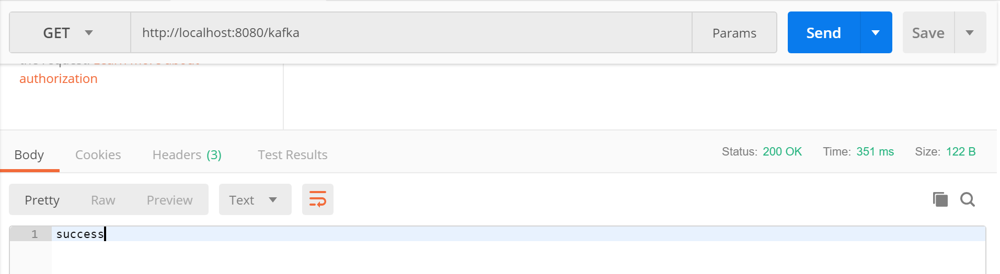
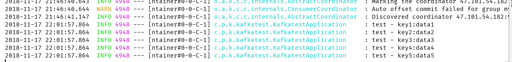

### Kafka的consumer以及provider
鉴于spring boot很好地整合了世面上的大多数消息中间件，所以我决定使用spring boot来做Kafka的consumer以及provider的实现，所以在pom文件中引入了spring-kafka这个依赖项目  
同时为了实现的简单，我使用了spring-mvc这个依赖项目，并通过RESTful请求的方式来作为provider的触发，并使用slf4j来作为consumer接收并记录provider发到Kafka的消息。

#### pom文件主要依赖引入
    <dependency>
        <groupId>org.springframework.boot</groupId>
        <artifactId>spring-boot-starter-web</artifactId>
        <version>1.5.6.RELEASE</version>
    </dependency>
    <dependency>
        <groupId>org.springframework.kafka</groupId>
        <artifactId>spring-kafka</artifactId>
    </dependency>

#### 配置文件
    spring.kafka.bootstrap-servers=47.101.54.182:9092
    spring.kafka.consumer.group-id=myGroup
    spring.kafka.consumer.key-deserializer=org.apache.kafka.common.serialization.StringDeserializer
    spring.kafka.consumer.value-deserializer=org.apache.kafka.common.serialization.StringDeserializer
    spring.kafka.producer.key-serializer=org.apache.kafka.common.serialization.StringSerializer
    spring.kafka.producer.value-serializer=org.apache.kafka.common.serialization.StringSerializer

#### Provider
    private void send(String key, String data) {
        kafkaTemplate.send("test", key, data);
    }

#### Consumer
    @KafkaListener(topics = "test")
    public void receive(ConsumerRecord<?, ?> consumer) {
        logger.info("{} - {}:{}", consumer.topic(), consumer.key(), consumer.value());
    }

#### 触发provider代码
    @RequestMapping("/kafka")
    public String testKafka() {
        int iMax = 6;
        for (int i = 1; i < iMax; i++) {
            send("key" + i, "data" + i);
        }
        return "success";
    }

#### 测试过程及结果

