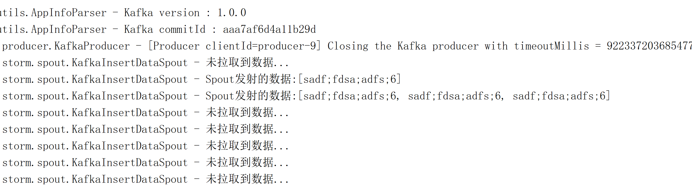

## 流处理的一个简易场景
#### 技术框架
SpringBoot + Kafka + Storm
#### 场景
-> 服务生成用户购买图书的订单log 

-> 生产消息发送到kafka消息队列 

-> 消费者Storm框架不断拉取Topic中的数据

-> Storm解析日志并筛选出订单中图书数量大于等于3本的订单信息

-> 将结构化的实体信息存储到Mysql数据库中

#### 运行截图
***控制台log***

***数据库存储***

