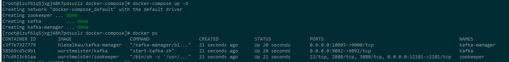

## kafka搭建步骤

通过docker可以很方便的搭建kafka集群作为本地测试环境使用  
所以这里使用docker-compose进行搭建，包含zookpper服务、kafka broker、kafka-manager。

### 安装docker与docker-compose
    yum install -y docker
    curl -L "https://github.com/docker/compose/releases/download/1.23.1/docker-compose-$(uname -s)-$(uname -m)" -o /usr/local/bin/docker-compose
    chmod a+x /usr/local/bin/docker-compose

### 创建目录
    mkdir -p ~/kafka/deploy
    cd ~/kafka/deploy
    vim docker-compose.yml

### 编辑docker—compose.yaml
    version: '2'

    services:
      zoo1:
        image: wurstmeister/zookeeper
        restart: unless-stopped
        hostname: zoo1
        ports:
          - "12181:2181"
        container_name: zookeeper

      # kafka version: 1.1.0
      # scala version: 2.12
      kafka1:
        image: wurstmeister/kafka
        ports:
          - "9092:9092"
        environment:
          KAFKA_ADVERTISED_HOST_NAME: xxx # 这里为宿主机host name
          KAFKA_ZOOKEEPER_CONNECT: "zoo1:2181"
          KAFKA_BROKER_ID: 1
          KAFKA_OFFSETS_TOPIC_REPLICATION_FACTOR: 1
        depends_on:
          - zoo1
        container_name: kafka
      kafka-manager:
        image: hlebalbau/kafka-manager
        restart: unless-stopped
        ports:
          - "10085:9000"
        environment:
          ZK_HOSTS: "zoo1:2181"
          APPLICATION_SECRET: "random-secret"
          KAFKA_MANAGER_AUTH_ENABLED: "true"
          KAFKA_MANAGER_USERNAME: "admin"
          KAFKA_MANAGER_PASSWORD: "TL2oo8tl2oo8"
        depends_on:
          - zoo1
        container_name: kafka-manager  
        command: -Dpidfile.path=/dev/null

### 启动kafka集群
    docker-compose up -d

### 成功启动kafka集群

