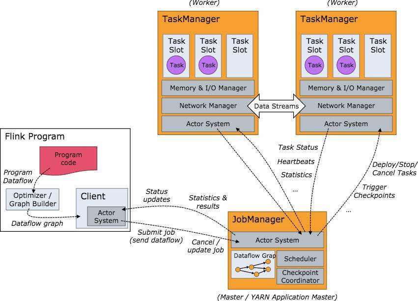
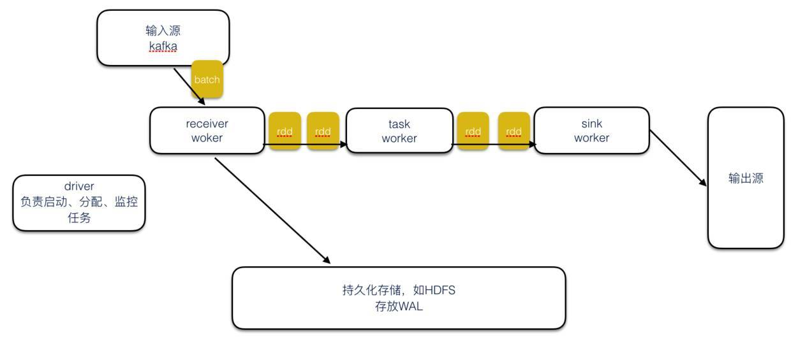
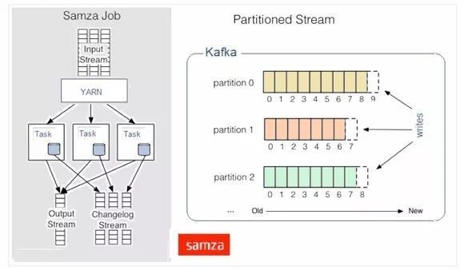
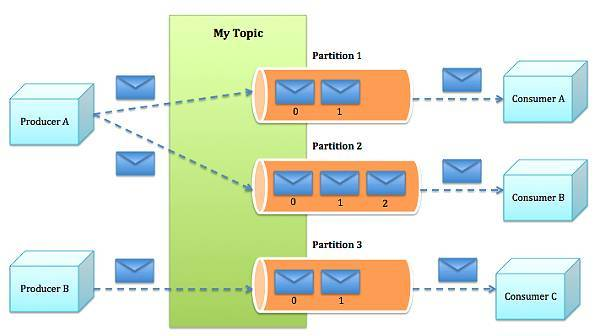

## Stream Computing Report
### 为什么会有流计算？
#### 传统运算
+ 收集数据，然后将数据放到数据库中。当人们需要的时候通过对数据库做query，得到结果或进行相关的处理。
+ 从时序上将在线事务处理和离线分析完全分割开来。
+ 离线计算 
+ 大批量计算

**但是，数据的业务价值随着时间的流失而迅速降低！因此在数据发生后必须尽快对其进行计算和处理！**

#### 流计算
**即是面向流数据的计算，针对于流计算系统而言，上游的流数据是实时，且持续的。**

+ 实时(realtime)且无界(unbounded)的数据流。流计算面对计算的 是实时且流式的，
  流数据是按照时间发生顺序地被流计算订阅和消费。且由于数据发生的持续性，数据流将长久且持续地集成进入流计算系统。
  例如，对于网站的访问点击日志流，只要网站不关闭其点击日志流将一直不停产生并进入流计算系统。
  因此，对于流系统而言，数据是实时且不终止(无界)的。
  
+ 持续(continuos)且高效的计算。流计算是一种”事件触发”的计算模式，触发源就是上述的无界流式数据。
  一旦有新的流数据进入流计算，流计算立刻发起并进行一次计算任务，因此整个流计算是持续进行的计算。
  
+ 流式(streaming)且实时的数据集成。流数据触发一次流计算的计算结果，可以被直接写入目的数据存储，例如将计算后的报表数据直接写入RDS进行报表展示。
  因此流数据的计算结果可以类似流式数据一样持续写入目的数据存储。
  
#### 主流流计算框架
##### Flink
Flink是一个针对流数据和批数据的分布式处理引擎，主要由Java代码实现。对 Flink 而言，其所要处理的主要场景就是流数据，
批数据只是流数据的一个极限特例而已。Flink 可以支持本地的快速迭代，以及一些环形的迭代任务，并且可以定制化内存管理。
在这点，如果要对比 Flink 和 Spark 的话，Flink 并没有将内存完全交给应用层。这也是为什么 Spark 相对于 Flink，
更容易出现 OOM 的原因（out of memory）。就框架本身与应用场景来说，Flink 更相似与 Storm。

##### Storm
Storm是一个分布式的、容错的实时计算系统，做作为最早的一个实时计算框架，早期应用于各大互联网公司。
在Storm出现之前，进行实时处理是非常痛苦的事情，我们主要的时间都花在关注往哪里发消息，
从哪里接收消息，消息如何序列化，真正的业务逻辑只占了源代码的一小部分。一个应用程序的逻辑运行在很多worker上，
但这些worker需要各自单独部署，还需要部署消息队列。最大问题是系统很脆弱，而且不是容错的：需要自己保证消息队列和worker进程工作正常。
Storm具有编程简单、高性能，低延迟、分布式、可扩展、容错、消息不丢失等特点。

##### Spark streaming
Spark streaming采用小批量的方式，提高了吞吐性能。Spark streaming批量读取数据源中的数据，
然后把每个batch转化成内部的RDD。Spark streaming以batch为单位进行计算），而不是以record为单位，
大大减少了ack所需的开销，显著满足了高吞吐、低延迟的要求，同时也提供exactly once功能。
但也因为处理数据的粒度变大，导致Spark streaming的数据延时不如Storm，Spark streaming是秒级返回结果（与设置的batch间隔有关），Storm则是毫秒级。

##### Apache Samza
Samza处理数据流时，会分别按次处理每条收到的消息。Samza的流单位既不是元组，也不是Dstream，而是一条条消息。
在Samza中，数据流被切分开来，每个部分都由一组只读消息的有序数列构成，而这些消息每条都有一个特定的ID。
该系统还支持批处理，即逐次处理同一个数据流分区的多条消息。Samza的执行与数据流模块都是可插拔式的，
尽管Samza的特色是依赖Hadoop的Yarn（另一种资源调度器）和Apache Kafka。

##### Apache Kafka
Kafka是一个分布式的、分区的、多复本的日志提交服务，它通过一种独一无二的设计提供了一个消息系统的功能。实现流处理最基本的方法是使用Kafka API读取输入数据流进行处理，并产生输出数据流。这个过程可以用任何编程语言实现。这种方法比较简单，易于操作，适应于任何有Kafka客户端的语言。

 