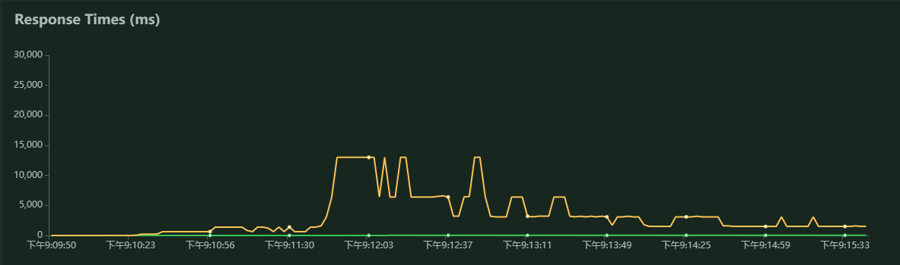
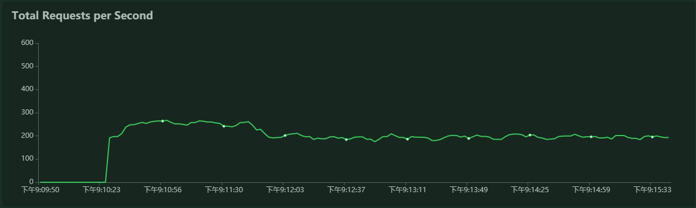
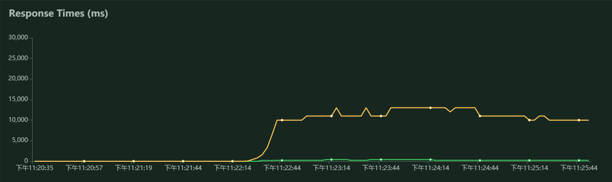
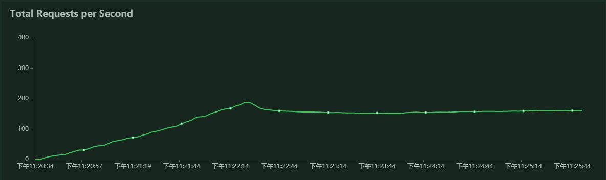

# Kubernetes Cluster Performance Test

## Test Prepare

### Front-end

- GET

    1. `/`

        get index

### Back-end

#### Interfaces

- GET

    1. `/api/persons?sex={sex}&email=`

        query by person sex

    2. `/api/persons?page={page}&email=`

        query by page

    3. `/api/persons/detail/{id}`

        query by person id

- PUT

    1. `/api/persons/detail/{id}` - `body: { "phone": <phone>, "zone": <zone> }`

        update the corresponding person's information. We just update phone and zone

#### Resource

* Memory : 500 M
* CPU: 500m

### Test Tools

* Locust

## Test Settings

### Locust

I distributes 3 slave locust on 3 Tencent CVMs and one master on another Tencent CVM. Each CVM has one core CPU and 1 GB memory.

* 10000 User
* 40 user/sec Swarm up
* Min wait 300ms
* Max wait 6000ms
* duration: 5 minutes

### Backend

We increase backend pod from 1, 3 to 5 pod.

### Front-end

## Test Result

### Back-end

* 1 Pod

__Request Statistics__

| Method | Name | Requests | Failures | Median response time | Average response time | Min response time | Max response time | Average Content Size | RPS |
| :--: | :-- | :--: | :--: | :--: | :--: | :--: | :--: | :--: | :--: | :--: | :--: | :--: |
| Get | /api/persons/detail/[id] | 42131 | 326956 | 23 | 82 | 2 | 61091 | 144 | 127.26 |
| GET | /api/persons?page=[page] | 11189| 132760| 37 | 4426 | 4 | 87208| 857 | 33.80 |
|GET | /api/persons?sex=[sex] | 5410 | 61861 | 240 | 6328 | 0 | 86932 | 1146  | 16.34 |
| PUT | /api/persons/detail/[id] | 8830  | 71952 | 24 | 98 | 0 | 52193 | 155 | 26.67 |
| None | Total | 67560  | 593529  | 25 | 1304 | 0 | 87208  | 344  | 204.07 |

__Response Time Distribution__

| Name |  requests | 50% | 66% | 75% | 80% | 90% | 95% | 98% | 99% | 100% | 
| :--: | :-- | :--: | :--: | :--: | :--: | :--: | :--: | :--: | :--: | :--: |
| GET | /api/persons/detail/[id] | 42131 | 23 | 26 | 28 | 30 | 43 | 230 | 620 | 1400 | 61000 |
| GET | /api/persons?page=[page] | 11189 | 37 | 240 | 650 | 1500 | 6500 | 52000 | 61000 | 66000 | 87000 |
| GET | /api/persons?sex=[sex] | 5410 | 240 | 670 | 1500 | 3200 | 26000 | 52000 | 62000 | 67000 | 87000 |
| PUT | /api/persons/detail/[id] | 8830 | 24 | 27 | 31 | 35 | 80 | 240 | 630 | 1400 | 52000 |
| Total | 67560 | 25 | 29 | 34 | 48 | 620 | 3100 | 15000 | 52000 | 87000 |

### Front-end

* 1 Pod

__Request Statistics__

| Method | Name | Requests | Failures | Median response time | Average response time | Min response time | Max response time | Average Content Size | RPS |
| :--: | :-- | :--: | :--: | :--: | :--: | :--: | :--: | :--: | :--: | :--: | :--: | :--: |
| GET | / | 46735 | 25 | 200 | 1510 | 1 | 62210 | 426 | 94.63
| None | Total | 46735 | 25 | 200 | 1510 | 0 | 62210 | 426 | 94.63

__Response Time Distribution__

| Name |  requests | 50% | 66% | 75% | 80% | 90% | 95% | 98% | 99% | 100% |
| :--: | :-- | :--: | :--: | :--: | :--: | :--: | :--: | :--: | :--: | :--: |
| GET | / | 46735 | 200 | 210 | 410 | 820 | 3300 | 10000 | 13000 | 23000 | 62000 |
| Total | 46735 | 200 | 210 | 410 | 820 | 3300 | 10000 | 13000 | 23000 | 62000 |

