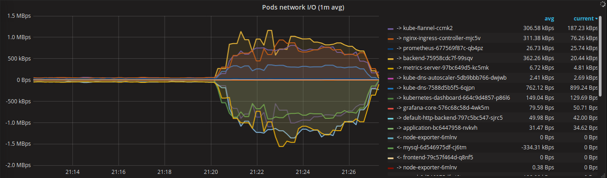

# Kubernetes Cluster Performance Test

## Test Prepare

### Front-end

#### API

- GET

    1. `/`

        get index

### Back-end

#### API

- GET

    1. `/api/persons?sex={sex}&email=`

        query by person sex

    2. `/api/persons?page={page}&email=`

        query by page

    3. `/api/persons/detail/{id}`

        query by person id

- PUT

    1. `/api/persons/detail/{id}` - `body: { "phone": <phone>, "zone": <zone> }`

        update the corresponding person's information. We just update phone and zone

### Test Tools

* Locust
  
    Locust can simulate thousands of users on a machine with few hardware resource.

## Test Settings

### Locust

I distributes 3 slave locust on 3 Tencent CVMs and one master on another Tencent CVM. Each CVM has one core CPU and 1 GB memory.

* 4000 User
* 10 user/sec Swarm up
* Min wait 300ms
* Max wait 6000ms
* duration: 5 minutes

### Backend

We increase backend pod from 1, 2 to 3 pod.

### Front-end

We increase backend pods from 1 to 3, with 3 backend pods providing service.

## Test Result

### Back-end

* 1 Pod

__Request Statistics__

| Method | Name | Requests | Failures | Median response time | Average response time | Min response time | Max response time | Average Content Size | RPS |
| :--: | :-- | :--: | :--: | :--: | :--: | :--: | :--: | :--: | :--: |
| GET | /api/persons/detail/[id] | 49715 | 35917 | 3 | 30 | 0 | 6474 | 144 | 84.88 |
| GET | /api/persons?page=[page] | 15653 | 14196 | 19 | 3869 | 0 | 86953 | 799 | 26.73 |
| GET | /api/persons?sex=[sex] | 7607 | 6647 | 220 | 5365 | 4 | 87334 | 1143 | 12.99 |
| PUT | /api/persons/detail/[id] | 819 | 506 | 11 | 82 | 0 | 6351 | 155 | 1.40 |
| None | Total | 73794 | 57266 | 5 | 1395 | 0 | 87334 | 386 | 126.00 |

__Response Time Distribution__

| Name |  requests | 50% | 66% | 75% | 80% | 90% | 95% | 98% | 99% | 100% | 
| :--: | :-- | :--: | :--: | :--: | :--: | :--: | :--: | :--: | :--: | :--: |
| GET | /api/persons/detail/[id] | 49715 | 3 | 4 | 5 | 6 | 16 | 210 | 280 | 620 | 6500 |
| GET | /api/persons?page=[page] | 15653 | 19 | 230 | 650 | 1400 | 6400 | 26000 | 61000 | 64000 | 87000 |
| GET | /api/persons?sex=[sex] | 7607 | 220 | 810 | 1400 | 3100 | 13000 | 52000 | 61000 | 66000 | 87000 |
| PUT | /api/persons/detail/[id] | 819 | 11 | 16 | 22 | 33 | 220 | 470 | 640 | 970 | 6400 |
| Total | 73794 | 5 | 9 | 17 | 210 | 630 | 3100 | 26000 | 52000 | 87000 |

* 2 Pod

__Request Statistics__

| Method | Name | Requests | Failures | Median response time | Average response time | Min response time | Max response time | Average Content Size | RPS |
| :--: | :-- | :--: | :--: | :--: | :--: | :--: | :--: | :--: | :--: |
| GET | /api/persons/detail/[id] | 41854 | 3257 | 6 | 525 | 1 | 66378 | 145 | 58.11 |
| PUT | /api/persons/detail/[id] | 630 | 59 | 14 | 470 | 0 | 13683 | 155 | 0.87 |
| GET | /api/persons?page=[page] | 12561 | 1635 | 570 | 5596 | 4 | 105685 | 805 | 17.44 |
| GET | /api/persons?sex=[sex] | 6039 | 713 | 1400 | 7805 | 4 | 90075 | 1144 | 8.39 |
| None | Total | 61084 | 5664 | 16 | 2287 | 0 | 105685 | 379 | 84.81 |

__Response Time Distribution__

| Name |  requests | 50% | 66% | 75% | 80% | 90% | 95% | 98% | 99% | 100% | 
| :--: | :-- | :--: | :--: | :--: | :--: | :--: | :--: | :--: | :--: | :--: |
| GET | /api/persons/detail/[id] | 41854 | 6 | 210 | 590 | 800 | 1500 | 2300 | 3600 | 4700 | 66000 |
| PUT | /api/persons/detail/[id] | 630 | 14 | 210 | 570 | 790 | 1500 | 2200 | 3500 | 4600 | 14000 |
| GET | /api/persons?page=[page] | 12561 | 570 | 1800 | 3100 | 4000 | 13000 | 52000 | 63000 | 67000 | 106000 |
| GET | /api/persons?sex=[sex] | 6039 | 1400 | 3100 | 5300 | 6800 | 26000 | 54000 | 65000 | 73000 | 90000 |
| Total | 61084 | 16 | 580 | 1000 | 1400 | 3100 | 7100 | 28000 | 61000 | 106000 |

* 3 Pod

__Request Statistics__

| Method | Name | Requests | Failures | Median response time | Average response time | Min response time | Max response time | Average Content Size | RPS |
| :--: | :-- | :--: | :--: | :--: | :--: | :--: | :--: | :--: | :--: |
| GET | /api/persons/detail/[id] | 36584 | 73 | 7 | 161 | 2 | 52196 | 145 | 111.74 |
| PUT | /api/persons/detail/[id] | 572 | 7 | 59 | 343 | 8 | 52333 | 155 | 1.75 |
| GET | /api/persons?page=[page] | 10249 | 219 | 620 | 6047 | 5 | 87328 | 803 | 31.30 |
| GET | /api/persons?sex=[sex] | 5190 | 92 | 1400 | 8557 | 5 | 87149 | 1145 | 15.85 |
| None | Total | 52595 | 391 | 26 | 2138 | 0 | 87328 | 372 | 160.65 |

__Response Time Distribution__

| Name |  requests | 50% | 66% | 75% | 80% | 90% | 95% | 98% | 99% | 100% | 
| :--: | :-- | :--: | :--: | :--: | :--: | :--: | :--: | :--: | :--: | :--: |
| GET | /api/persons/detail/[id] | 36584 | 7 | 44 | 88 | 110 | 280 | 660 | 1500 | 3100 | 52000 |
| PUT | /api/persons/detail/[id] | 572 | 60 | 210 | 260 | 300 | 620 | 900 | 1700 | 3300 | 52000 |
| GET | /api/persons?page=[page] | 10249 | 620 | 1500 | 3100 | 3900 | 14000 | 52000 | 62000 | 67000 | 87000 |
| GET | /api/persons?sex=[sex] | 5190 | 1400 | 3100 | 6400 | 7300 | 26000 | 53000 | 64000 | 73000 | 87000 |
| Total | 52595 | 26 | 150 | 280 | 620 | 3100 | 6700 | 52000 | 61000 | 87000 |

### Front-end

* 1 Pod

__Request Statistics__

| Method | Name | Requests | Failures | Median response time | Average response time | Min response time | Max response time | Average Content Size | RPS |
| :--: | :-- | :--: | :--: | :--: | :--: | :--: | :--: | :--: | :--: |
| GET | / | 43877 | 442 | 210 | 1912 | 1 | 62215 | 426 | 94.41 |
| None | Total | 43877 | 442 | 210 | 1912 | 0 | 62215 | 426 | 94.41 |

__Response Time Distribution__

| Name |  requests | 50% | 66% | 75% | 80% | 90% | 95% | 98% | 99% | 100% |
| :--: | :-- | :--: | :--: | :--: | :--: | :--: | :--: | :--: | :--: | :--: |
| GET | / | 46735 | 200 | 210 | 410 | 820 | 3300 | 10000 | 13000 | 23000 | 62000 |
| Total | 46735 | 200 | 210 | 410 | 820 | 3300 | 10000 | 13000 | 23000 | 62000 |

* 2 Pod

__Request Statistics__

| Method | Name | Requests | Failures | Median response time | Average response time | Min response time | Max response time | Average Content Size | RPS |
| :--: | :-- | :--: | :--: | :--: | :--: | :--: | :--: | :--: | :--: |
| GET | / | 42028 | 155 | 210 | 2528 | 1 | 63181 | 426 | 104.86 |
| None | Total | 42028 | 155 | 210 | 2528 | 0 | 63181 | 426 | 104.86 |

__Response Time Distribution__

| Name |  requests | 50% | 66% | 75% | 80% | 90% | 95% | 98% | 99% | 100% |
| :--: | :-- | :--: | :--: | :--: | :--: | :--: | :--: | :--: | :--: | :--: |
| GET / | 42028 | 210 | 410 | 1400 | 3200 | 10000 | 11000 | 16000 | 36000 | 63000 |
| Total | 42028 | 210 | 410 | 1400 | 3200 | 10000 | 11000 | 16000 | 36000 | 63000 |

* 3 Pod

__Request Statistics__

| Method | Name | Requests | Failures | Median response time | Average response time | Min response time | Max response time | Average Content Size | RPS |
| :--: | :-- | :--: | :--: | :--: | :--: | :--: | :--: | :--: | :--: |
| GET | / | 43684 | 529 | 210 | 2395 | 1 | 63158 | 426 | 75.51 |
| None | Total | 43684 | 529 | 210 | 2395 | 0 | 63158 | 426 | 75.51 |

__Response Time Distribution__

| Name |  requests | 50% | 66% | 75% | 80% | 90% | 95% | 98% | 99% | 100% |
| :--: | :-- | :--: | :--: | :--: | :--: | :--: | :--: | :--: | :--: | :--: |
| GET / | 43684 | 210 | 410 | 820 | 1600 | 10000 | 11000 | 16000 | 36000 | 63000 |
| Total | 43684 | 210 | 410 | 820 | 1600 | 10000 | 11000 | 16000 | 36000 | 63000 |

## Conclusion

When backend pods increases from 1 to 3, from CPU usage graph and network I/O, it is obvious that the load is spread to each pod. But clearly, not absolutely equally distributed.

As backend pods increases, total RPS and response time doesn't see much difference, but failures drops sharply. Maybe increase the user amount to 10K difference on RPS and response time can be told clearly.

It's quite interesting when we look at frontend, the failure is least when 2 pods, most when 3 pods. From CPU, memory and network load graph, load balance is not quite obvious, but some effect can be found.