# Kafka benchmark

## Experiment Settings

* Aliyun ECS
    | | |
    |:--:|:--:|
    | CPU | 1 core|
    | Memory | 2G |
    | Disk | 40G |
    | Bandwith | 1M |

    Deploy: 
    - one Kafka cluster with one broker
    - one Kafka manager
    - one zookeeper

* Test machine
    |    |    |
    |:--:|:--:|
    | CPU | 8 core |
    | Memory | 4G | 
    | Disk | 32G |
    | Bandwith | 100M |

_As test bench will consume certain amount of machine resource, I run test bench on another machine to provide a more stable environment for Kafka._

Here we run two test, one is to publish messages to Kafka, the other is to consume messages from Kafka. The main two test scripts are provided by Kafka, the `kafka-producer-perf-test.sh` and the `kafka-consumer-perf-test.sh`. 

Test result are in **result** directory.
- `test-producer-${record size}-${throughput}.txt`
- `test-consumer-${fetch size}.txt`

## Producer Test Result

* Real Throughput under different record size and ideal throughput
    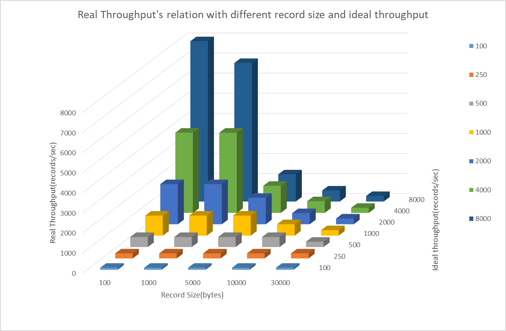

* Speed under different record size and ideal throughput
    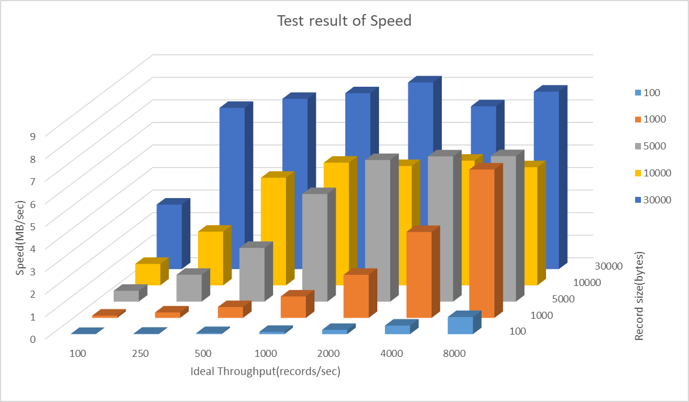

* average latency under different record size and ideal throughput
    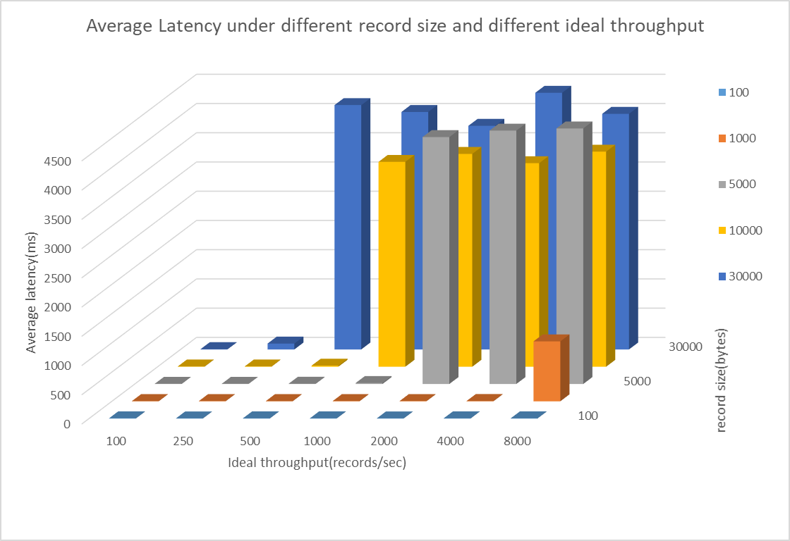

* maxium latency under different record size and ideal throughput
    

    According to these data, I observe that when record size is bigger than 1 KB and ideal throughput is high, real throughput drops sharply.   
    As for speed, when record size is far smaller than 1 KB, speed is quite low even with a high throughput; when  record size is quite large, for example, larger than 5 KB, the speed will hit the bottle neck soon as ideal throughput are not very high.  
    Situations for average latency and maxium latency are quite similiar, when ideal throughput and record size are suitable for Kafka broker, the latency is very low. Once the workload is too heavy for broker, approximately 10 MB/s, the latency climbs up sharply, leading to poor performance.

## Consumer Test Result

* Data consumed(MB)
    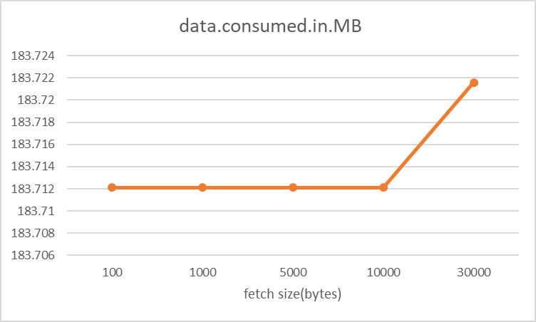

* Consume Rate(MB/sec)
    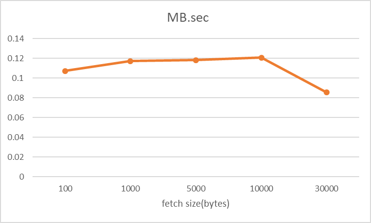

* Message consumed
    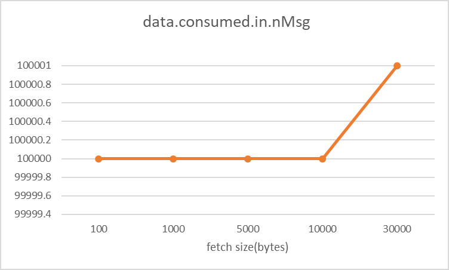

* Message consuming rate
    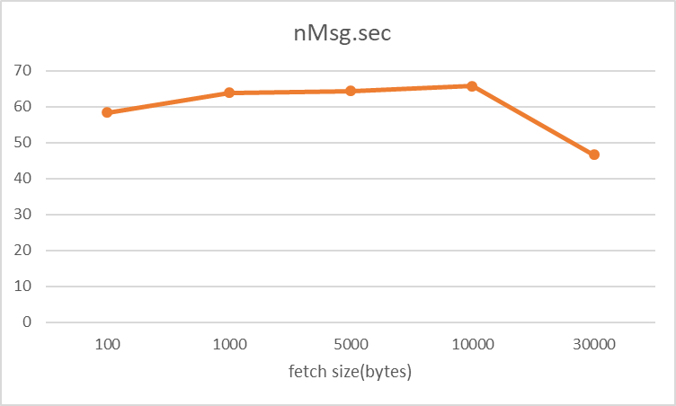

* Rebalance time(ms)
    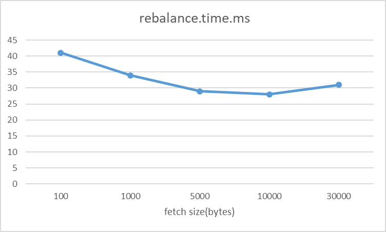

* Fetch time(ms)
    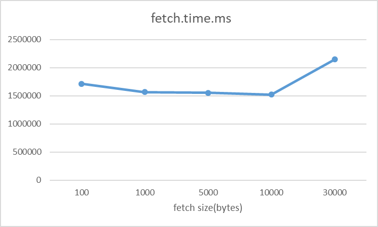

* Fetch rate(MB/sec)
    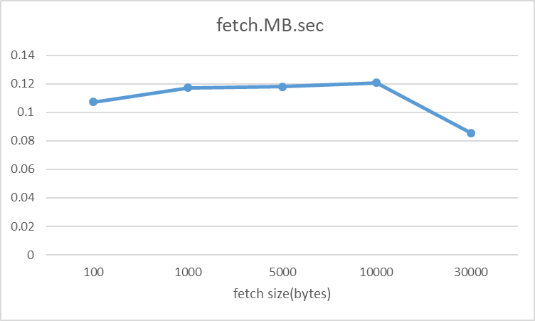

* Message Fetch rate(nMsg/sec)
    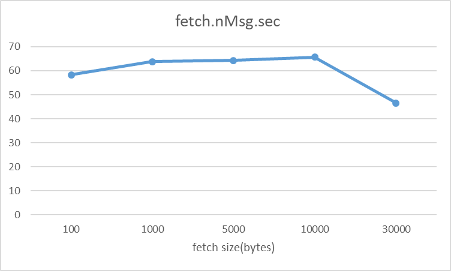

    Above graphs indicates that fetch size has nothing to do with total amount of data consumed. And consumed rates and consumed messages are quite close.   
    I only observe that when fetch size reach 30000 bytes, fetch message costs more time and slows down. Probably the broker reaches the bottle neck on bandwith or disk, even both.