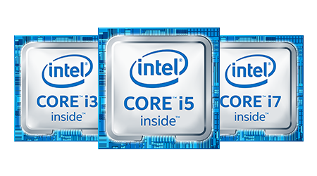
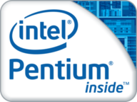
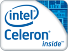
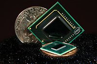
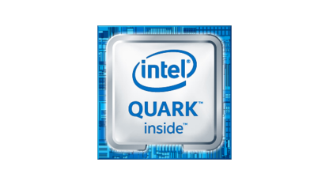
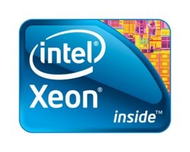
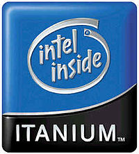

## cpu

### vendors
+ Intel公司

      Intel占有CPU市场的80%多的份额，Intel生产的CPU就成了事实上的x86CPU技术规范和标准。英特尔是美国一家主要以研制CPU处理器的公司，是全球最大的个人计算机零件和CPU制造商，它成立于1968年，具有近50年产品创新和市场领导的历史。1971年，英特尔推出了全球第一个微处理器。微处理器所带来的计算机和互联网革命，改变了整个世界。在2016年世界五百强中排在第51位。2014年2月19日，英特尔推出处理器至强E7 v2系列采用了多达15个处理器核心，成为英特尔核心数最多的处理器。

+ AMD公司
  
      超微半导体公司（英语：Advanced Micro Devices, Inc.；缩写：AMD），创立于1969年，是一家专注于微处理器及相关技术设计的跨国公司，总部位于美国加州旧金山湾区硅谷内的森尼韦尔市。最初，超微拥有晶圆厂来制造其设计的芯片，自2009年以后，超微成为无厂半导体公司，仅负责硬件集成电路设计及产品销售业务。现时，超微的主要产品是中央处理器（包括嵌入式平台）、图形处理器、主板芯片组以及计算机存储器。

      超微半导体是目前除了英特尔以外，最大的x86架构微处理器供应商，自收购冶天科技以后，则成为除了英伟达以外仅有的独立图形处理器供应商，自此成为一家同时拥有中央处理器和图形处理器技术的半导体公司，也是唯一可与英特尔和英伟达匹敌的厂商。在2017年第一季全球个人计算机中央处理器的市场占有率中，英特尔以79.8％排名第一、AMD以20.2％位居第二。

+ 神州龙芯

      神州龙芯是由中国科学院计算技术研究所及江苏综艺股份有限公司共同投资创办的一家致力于开发具有自主知识产权的龙芯系列微处理器芯片及相应产品的高新技术企业，其中，中科院控股67%，综艺股份持股32.67%。中国科学院龙芯首席科学家胡伟武在数十年研发过程中居主导。

      龙芯（英语：Loongson）是由中国科学院计算技术研究所胡伟武等人所设计的通用中央处理器，采用MIPS精简指令集架构，获得了MIPS科技公司专利授权。第一型的速度是266MHz，于2002年起使用；2号速度最高为1GHz，3号于2010年推出成品，而设计的目标在多核心。目前中国科学院计算技术研究所亦有研发以龙芯为处理器的超级计算机计划。

### types
+ 酷睿

      Intel Core属于Pentium M架构的最后一代产品。它是英特尔在2006年1月打造新形象时发布的新一代处理器。芯片产品代号为Yonah（来自希伯来语的יונה‎），并于2006年1月5日（东亚） / 1月6日（美国）发行。这是Intel的第一款32位双核移动低功耗处理器、第一款65nm制程的移动处理器。
    

+ 奔腾

    奔腾（Pentium）是英特尔公司的一个注册商标，作为其x86处理器品牌之一，于1993年推出。以往，“奔腾”是英特尔的唯一的x86处理器产品线，后来随着其产品线的扩展派生出低端的“赛扬”（Celeron）系列、供服务器以及工作站使用的“至强”（Xeon）系列。2006年英特尔推出“酷睿”（Core）系列处理器产品线，取代原奔腾处理器系列的市场定位。时至今日，“奔腾”这个品牌仍然继续使用，但市场定位被定位为比低端入门型的赛扬系列高一级，比横贯中高端主流型和高端旗舰型的酷睿系列低一级的中端入门型级别。

    &nbsp;&nbsp;&nbsp;&nbsp;&nbsp;&nbsp;&nbsp;&nbsp;&nbsp;&nbsp;&nbsp;&nbsp;&nbsp;&nbsp;&nbsp;&nbsp; 

+ 赛扬
  
      赛扬处理器是Intel旗下的“经济型”产品。赛扬与奔腾或酷睿处理器使用的核心相同，但不同的是，赛扬处理器往往要比高端处理器处理能力低。
    &nbsp;&nbsp;&nbsp;&nbsp;&nbsp;&nbsp;&nbsp;&nbsp;&nbsp;&nbsp;&nbsp;&nbsp;&nbsp;&nbsp;&nbsp;&nbsp; 

+ 凌动

      英特尔凌动处理器(Intel Atom)是Intel的一个超低电压处理器系列，采用45纳米制程制造，集成4700万个晶体管。L2缓存为512KB，支持SSE3指令集和Intel VT（部分型号）。与一般的桌面处理器不同，Atom处理器采用顺序执行设计，这样做可以减少晶体管的数量。近年，Intel利用Intel Bonnell微处理器架构开发Atom。Intel Atom 使用16级指令流水线为了达到最低电力并且延长电池的寿命。
    &nbsp;&nbsp;&nbsp;&nbsp;&nbsp;&nbsp;&nbsp;&nbsp;&nbsp;&nbsp;&nbsp;&nbsp;&nbsp;&nbsp;&nbsp;&nbsp; 

+ Quark Soc
  
      Intel在美国旧金山的IDF 2013发表最新的微型 SOC系统晶片Quark X1000，与现有的Atom相比，面积不但缩小五分之一，电力消耗更只有Atom的十分之一。Intel把Quark晶片组定位在穿戴型科技、消费型电子产品与生物监测设备等应用中。
    

+ 至强

      Xeon是Intel的一个中央处理器品牌，主要供服务器及工作站使用，亦有超级计算机采用此处理器。它与奔腾（Pentium）系列一样，经过几代处理器架构的变迁后，名字仍保留下来。Xeon采用x86架构和/或x86-64架构。

      至强Xeon用于"中间范围"的企业服务器和工作站。在英特尔的服务器主板上，最多达八个Xeon处理器能够共用100MHz的总线而进行多路处理。Xeon设计用于因特网以及大量的数据处理服务，例如工程、图像和多媒体等需要快速传送大量数据的应用。

      基于奔腾微处理器P6构架，它被设计成与新的快速外围元件互连线以及加速图形端口一起工作。Xeon具有：512千字节或1兆字节，400MHz的高速缓冲存储器、在处理器、RAM和I/O器件之间传递数据的高速总线、能提供36位地址的扩展服务器内存结构。
    

+ 安腾

      安腾(Itanium)处理器是构建在IA-64上的，也就是说“IA-64是一个与x86代码的决裂，它是为未来设计的“。该处理器的市场定位是在于企业服务器与高性能运算系统。该架构由惠普创始，后来则是惠普与英特尔共同开发。

      安腾的微架构是彻底的不同于其他英特尔处理器采用的x86（包含x86-64）架构。这个架构是建基于显性的指令并发，由编译器来决定哪些指令并发处理。这种方式允许处理器在每个周期最多可以运行6个指令。与超标量架构的不同点，安腾在并发处理中并没有复杂的线路来判断指令依赖性，所以编译器必须要在编译的时候就已经处理妥当。Intel安腾2处理器的平台以较低的成本，提供了业界领先的性能，以及比专有RISC技术更广泛的选择空间，可帮助企业和机构最大地提高其投资回报。
    

### key features
+ CPU的工作电压

      工作电压是指CPU正常工作时所需的电压。工作电压越高，CPU的发热量越大，工作越不稳定，甚至会造成死机或烧坏CPU。早期386、486的工作电压一般为5V，Pentium的工作电压是3.5V、3.3V、2.8V、1.6V等。随着CPU的制造工艺与主频的提高，CPU的工作电压还在逐步下降。低电压的CPU的芯片总功耗降低了，使得系统的运行成本就相应降低，这对于便携式和移动系统来说，可以让电池工作更长的时间，也使电池的使用寿命大大延长。功耗降低还可使发热量减少，让CPU与系统配合更好。可以说降低电压是CPU主频提高的重要因素之一。

      586系列以后的CPU按工作电压可分为两种，一种是单电压CPU，另外一种则是双电压CPU。单电压CPU有Intel Pentium系列的P54C、AMD-K5及Cyrix的6x86等系列。双电压CPU则有Intel MMX P55C的PentiumⅡ、AMD的K6、Cyrix的6x86及M2等系列。而这些双电压CPU所使用的工作电压则可以被区分成Vcore（内核电压）和Vio（I/O电压）两个部分。

+ CPU的生产工艺

      表明CPU性能的参数中常有“工艺技术”一项，如“0.35mm”或“0.25mm”。目前生产CPU主要采用CMOS技术，这种技术生产CPU采用“光刀”加工各种电路和元器件，并采用金属铝沉淀在硅材料上，然后用“光刀”刻成导线连接各元器件。光刻的精度一般用微米表示，精度越高就可在同样体积的硅材料上生产更多的元件，加工出更细的连线，CPU工作主频就可以更高。

+ CPU的位、字节和字长

      CPU可以同时处理的二进制数据位数是其最重要的一个品质标志。通常所说的16位机、32位机就是指该微机中的CPU可以同时处理16位、32位的二进制数据。现在的CPU都是64位机。64位微处理器一次可以处理8个字节的信息。