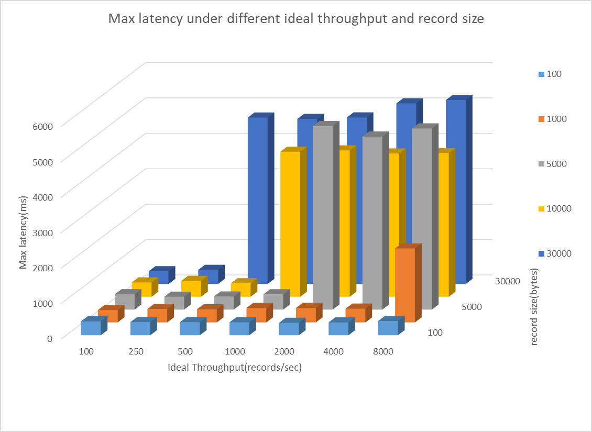

# Kafka benchmark

## Experiment Settings

* Aliyun ECS
    | | |
    |:--:|:--:|
    | CPU | 1 core|
    | Memory | 2G |
    | Disk | 40G |
    | Bandwith | 1M |

    Deploy: 
    - one Kafka cluster with one broker
    - one Kafka manager
    - one zookeeper

* Test machine
    |    |    |
    |:--:|:--:|
    | CPU | 8 core |
    | Memory | 4G | 
    | Disk | 32G |
    | Bandwith | 100M |

_As test bench will consume certain amount of machine resource, I run test bench on another machine to provide a more stable environment for Kafka._

Here we run two test, one is to publish messages to Kafka, the other is to consume messages from Kafka. The main two test scripts are provided by Kafka, the `kafka-producer-perf-test.sh` and the `kafka-consumer-perf-test.sh`. 

Test result are in **result** directory.
- test-producer-${record size}-${throughput}.txt
- test-consumer-${fetch size}.txt

## Producer Test Result

* Real Throughput under different record size and ideal throughput
    

* Speed under different record size and ideal throughput
    

* average latency under different record size and ideal throughput
    

* maxium latency under different record size and ideal throughput
    