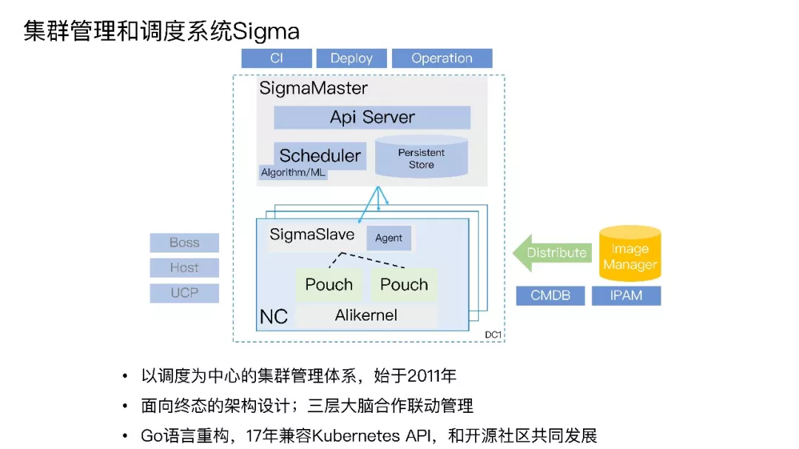

characteristic:

+ Sigma 有 Alikenel、SigmaSlave、SigmaMaster 三层大脑联动协作，Alikenel 部署在每一台物理机上，对内核进行增强，在资源分配、时间片分配上进行灵活的按优先级和策略调整，对任务的时延，任务时间片的抢占、不合理抢占的驱逐都能通过上层的规则配置自行决策。SigmaSlave 可以在本机进行容器 CPU 分配、应急场景处理等。通过本机 Slave 对时延敏感任务的干扰快速做出决策和响应，避免因全局决策处理时间长带来的业务损失。SigmaMaster 是一个最强的中心大脑，可以统揽全局，为大量物理机的容器部署进行资源调度分配和算法优化决策。

+ 整个架构是面向终态的设计理念，收到请求后把数据存储到持久化存储层，调度器识别调度需求分配资源位置，Slave识别状态变化推进本地分配部署。系统整体的协调性和最终一致性非常好。我们在 2011 年开始做调度系统，2016 年用 Go 语言重写，2017 年兼容了 kubernetes API，希望结合生态的力量，共同建设和发展。

pros:

cons