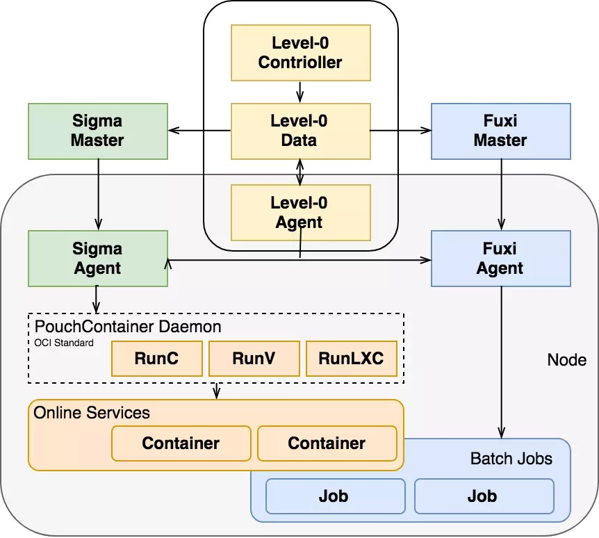
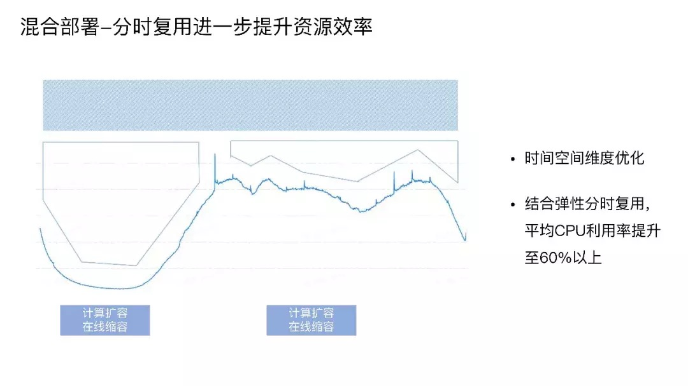

简介:
+ Sigma是阿里集团众多业务的底层标准容器服务提供者。如果把阿里全部业务比作人体，Pouch容器就是一个个细胞，不同业务组成不同的组织和器官。Sigma就是控制这些细胞、组织和器官的神经系统。
+ Sigma 有 Alikenel、SigmaSlave、SigmaMaster 三层大脑联动协作，Alikenel 部署在每一台物理机上，对内核进行增强，在资源分配、时间片分配上进行灵活的按优先级和策略调整，对任务的时延，任务时间片的抢占、不合理抢占的驱逐都能通过上层的规则配置自行决策。SigmaSlave 可以在本机进行容器 CPU 分配、应急场景处理等。通过本机 Slave 对时延敏感任务的干扰快速做出决策和响应，避免因全局决策处理时间长带来的业务损失。SigmaMaster 是一个最强的中心大脑，可以统揽全局，为大量物理机的容器部署进行资源调度分配和算法优化决策。

+ 整个架构是面向终态的设计理念，收到请求后把数据存储到持久化存储层，调度器识别调度需求分配资源位置，Slave识别状态变化推进本地分配部署。系统整体的协调性和最终一致性非常好。阿里在 2011 年开始做调度系统，2016 年用 Go 语言重写，2017 年兼容了 kubernetes API。

混部架构

+ 阿里巴巴在 2014 年开始推动混部架构，目前已在阿里巴巴内部大规模部署。在线服务属于长生命周期、规则策略复杂性高、时延敏感类任务。而计算任务生命周期短、调度要求大并发高吞吐、任务有不同的优先级、对时延不敏感。基于这两种调度的本质诉求的不同，阿里在混合部署的架构上把两种调度并行处理，即一台物理机上可以既有 Sigma 调度又有 Fuxi 调度，实现基础环境统一。Sigma 调度是通过 SigmaAgent 启动 PouchContainer 容器。Fuxi 也在这台物理机上抢占资源，启动自己的计算任务。所有在线任务都在PouchContainer 容器上，它负责把服务器资源进行分配并运行在线任务，离线任务填入其空白区，保证物理机资源利用达到饱和，这样就完成了两种任务的混合部署。

+ 通过分时复用，达到进一步提升资源效率的效果。上图中的曲线是阿里某个应用的流量曲线。它是非常有规律的 , 左边代表晚上波谷期，右边代表白天处于波峰期。正常的混部指占用图中蓝色阴影部分的资源把利用率提高到 40%，弹性分时复用技术是指对应用画像找到应用流量波谷期，对应用缩容，大量释放内存和 CPU，调度更多计算任务。通过这项技术，把平均 CPU 利用率提升到 60% 以上。

优点：
+ Sigma灵活的按优先级和策略调整资源分配和时间片。除此之外还能自行决策任务时间片的驱逐的规则配置大幅度解放了人力资源。实现调度优化。另外通过在本机进行容器CPU分配和应急场景处理，本机Sigma子系统对干扰可以做出快速的决策与响应，这种快速响应最大限度的减少了延时带来的业务损失。
+ 在数据一致性方面，Sigma将收到的数据快速存储到持久化层，SigmaSlave进行本地部署，保证了系统整体的协调性和最终一致性。

缺点：
+ Sigma相关的社区并不活跃，Sigma技术的应用目前为止也仅在阿里内部，这可能影响了技术的推广与技术的提升。
+ Sigma应对的场景是阿里亿计的并发量，在这种情况下，系统追求的是更高的响应速度与可扩展性，在这种情况下，更好的调度策略意味着大量的计算，可能会因为响应时间过长等原因被抛弃，如何在最短时间和最有效率完成业务容量就成为需要衡量的因素。

评价：
+ 在双 11 场景中，利用规模化运维系统在容器上构建大量在线服务，包括业务层的混合部署，每个集群都有 online service 和有状态服务及大数据分析。阿里云的独占集群也部署了在线服务和有状态的数据服务，做到了 datacenter as a computer，多个数据中心像一台计算机一样来管理，实现跨多个不同的平台来调度业务的发展所需要的资源。构建了混合云用极低的成本拿到服务器，解决有没有的问题。
+ 阿里先有服务器规模，再通过分时复用和混合部署来大幅度提升资源利用率。真正实现了弹性资源平滑复用任务灵活混合部署，用最少的服务器最短的时间和用最优效率完成业务容量目标。利用Sigma调度系统，阿里在双 11 实现了新增 IT 成本降低 50%，使日常 IT 成本下降 30%，Sigma的使用带来集群管理和调度领域的技术价值的爆发。
+ 阿里调度系统团队，一直致力于打造全球效率最优的调度和集群管理系统，通过企业级容器和容器平台建设最优云化解决方案。Sigma系统使用降低了整个行业的IT成本，解放了行业生产力，加速企业的发展。